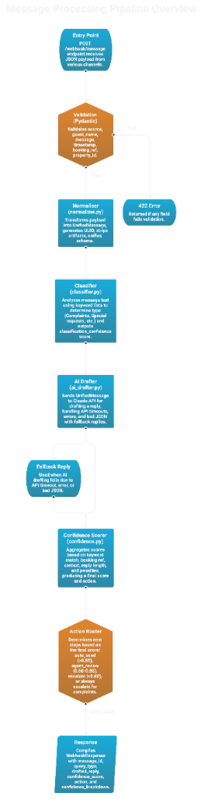

# Nistula Guest Message Handler

AI-powered unified guest messaging backend for [Nistula](https://nistula.life), a luxury villa and apartment rental company based in Assagao, Goa.

Built with FastAPI, Claude API integration, rule based query classification, and a PostgreSQL schema designed for multi-channel hospitality operations.

---

## The Problem

Nistula manages luxury villas across multiple booking platforms: WhatsApp, Booking.com, Airbnb, Instagram, and direct enquiries. Each channel brings its own message format, its own quirks, and its own urgency.

A guest asking "Is the villa available?" on WhatsApp at 2pm is a sales opportunity. A guest writing "The AC is not working. I want a refund." at 3am is a fire drill.

The challenge: **build a system that understands the difference, drafts intelligent responses, and knows when to let AI handle it vs. when to wake up a human.**

That's what this project does.

---

## How It Works

<p align="center">
  
</p>

**Pipeline stages:**

1. **Entry Point** — `POST /webhook/message` receives JSON from any channel
2. **Validation** — Pydantic checks source, guest_name, message, timestamp → 422 if invalid
3. **Normaliser** — Generates UUID, strips channel artifacts (e.g. Booking.com prefixes), unifies schema
4. **Classifier** — Rule-based keyword matching across 5 priority-ordered categories → outputs query type + classification confidence. Complaints are checked first so a message like "WiFi not working, I want a refund" is classified as a complaint, not a check-in query.
5. **AI Drafter** — Sends unified message + full property context to Claude API → handles timeouts, errors, and bad JSON with per-type fallback replies
6. **Confidence Scorer** — Additive model starting at 0.50, adjusts based on keyword match, booking ref, context coverage, reply quality, multi-question penalty, complaint cap
7. **Action Router** — Maps final score to `auto_send` (>0.85), `agent_review` (0.60–0.85), or `escalate` (<0.60). Complaints always escalate.
8. **Response** — Returns message_id, query_type, drafted_reply, confidence_score, action, and full breakdown

### Data Flow

<p align="center">
  
</p>

---

## Real-World Flow — What Happens When a Guest Messages

To understand how this system works in production, here's what happens when a real guest sends a message:

**3:02 AM — Vikram picks up his phone and sends a WhatsApp message to Nistula:**

> *"The AC is not working in the master bedroom. This is unacceptable. I want a refund for tonight."*

**3:02 AM — WhatsApp Business API pushes the message to our webhook:**

WhatsApp automatically POSTs Vikram's message to `POST /webhook/message`. We don't poll or scrape. Every channel (WhatsApp, Booking.com, Airbnb, Instagram) pushes messages to us in real time via webhooks.

**3:02 AM — Our pipeline processes it in ~3 seconds:**

1. **Validate** — Payload schema checks pass
2. **Normalise** — Strips channel specific artifacts, assigns UUID, maps to unified schema
3. **Classify** — Keyword matching detects "not working", "unacceptable", "refund" → `complaint`
4. **AI Draft** — Claude generates an empathetic response using Villa B1's property context (caretaker hours, amenities, policies)
5. **Confidence Score** — Starts at 0.50, gains +0.20 for clear keyword match, +0.10 for booking ref — but gets **capped at 0.55** because it's a complaint. Complaints should never be auto-sent.
6. **Action** — Score 0.55 + complaint type → **ESCALATE**

**3:02 AM — The system decides what happens next based on the action:**

| Action | Behaviour |
|--------|-----------|
| `auto_send` (score > 0.85) | Reply is sent back to WhatsApp automatically. Guest sees it in 3 seconds. No human involved. |
| `agent_review` (0.60–0.85) | Reply appears in the agent dashboard. Agent reads, optionally edits, clicks "Send". |
| `escalate` (< 0.60 or complaint) | Reply goes to agent dashboard **AND** immediate alerts fire to management. |

**3:02 AM — For Vikram's complaint, escalation alerts fire in parallel:**

- SMS to on-call manager: *"URGENT: AC complaint at Villa B1, Guest: Vikram Patel"*
- Push notification to the Nistula ops app
- Slack message to #urgent-ops channel
- Email to the Villa B1 caretaker

**3:02 AM — The drafted reply is sent back to Vikram on WhatsApp:**

The system calls the WhatsApp Business API to post the reply back to the same chat thread. Vikram sees a response within seconds. He doesn't know AI was involved. It reads like a human replied at 3 AM.

**What gets stored (using our schema.sql):**

The original message, the AI draft, the confidence score (0.55), the action taken (escalate), whether the agent edited the reply, and the resolution timeline — all linked to Vikram's guest profile and his booking `NIS-2024-0950`.

**What we built vs. what production adds:**

| Layer | This Assessment | Production Adds |
|-------|----------------|-----------------|
| Receive messages | ✅ Webhook endpoint | Channel-specific adapters (~50 lines each) |
| Process & classify | ✅ Full pipeline | Same |
| Draft AI replies | ✅ Claude + fallbacks | Same |
| Score & route | ✅ Confidence + action | Same |
| Send reply back | Returns JSON | POST to WhatsApp/Booking.com API |
| Alert management | Action field in response | SMS/Slack/email notification service |
| Store everything | Schema designed | Connect PostgreSQL with SQLAlchemy |

The pipeline we built is the decision engine. The channel adapters and notification services are thin integration layers that carry messages in and replies out.

---

## The Journey — What I Built, Broke, and Rebuilt

Building this wasn't a straight line. Here's what actually happened.

### 1. The Schema Problem

My first database schema had 7 tables — separate `ai_responses` for AI draft history, `guest_channel_identifiers` for cross-channel identity resolution, an `escalation_log` for tracking handoffs.

It was architecturally "correct." But when I started writing queries for the agent dashboard, every single one needed 3-4 JOINs just to show a message with its confidence score. For a startup processing maybe 50 messages a day, that's over-engineering.

**What I did:** Merged AI fields directly into the `messages` table. Flattened guest identifiers into the `guests` table. Went from 7 tables to 5. The queries got simpler, the schema got readable, and nothing was lost — we can always split tables later when scale demands it.

### 2. The Confidence Score Dilemma

First attempt: a 4-factor weighted average.

```
confidence = (classification × 0.30) + (context_coverage × 0.30)
           + (sentiment_clarity × 0.20) + (response_specificity × 0.20)
```

It worked numerically. But when I tested it and got a score of 0.73, I couldn't explain *why* it was 0.73 without tracing through four weighted calculations. If I can't explain it, an operations manager at 3am definitely can't.

**What I did:** Replaced it with an additive model. Start at 0.50, add or subtract based on clear rules:

```
Start: 0.50 (neutral)

+ 0.20  if classifier found a clear keyword match
+ 0.10  if booking reference is present
+ 0.15  if property context contains the answer
+ 0.10  if AI returned a substantive reply (>50 chars)
- 0.10  if message contains multiple questions
cap 0.55 if complaint (always needs human)

→ Clamp to [0.0, 1.0]
```

Now every score is explainable. "This scored 0.85 because: clear keyword match (+0.20), booking ref present (+0.10), context has the answer (+0.15), and the AI gave a solid reply (+0.10). Minus 0.10 because there were 2 questions."

An agent can read that at 3am and make a decision.

### 3. The "What If Claude Goes Down?" Problem

The biggest risk in any AI powered system: the AI is an external dependency. Claude API could timeout, rate limit, or go down entirely. A guest should never send a message and get... nothing.

**What I did:** Every query type has a handwritten fallback reply. If Claude is unavailable, the guest gets a polite, specific response like:

> "Hi Rahul, thank you for your interest! Let me check the availability details for you — our team will get back to you shortly with confirmed dates and rates."

Not perfect. But the guest knows they were heard, and the message is flagged for human follow-up. The system never goes silent.

### 4. The Environment Variable Trap

First time I deployed, the API key wasn't loading. The `.env` file had the correct key, but Pydantic's `BaseSettings` was reading an empty `ANTHROPIC_API_KEY` from my shell environment instead. An empty shell variable overrides a `.env` value because the OS environment takes priority.

**What I did:** Added explicit `load_dotenv(override=True)` before Pydantic initialises. The `override=True` flag forces `.env` values to take precedence over shell variables. Small fix, but it's the kind of bug that wastes hours if you don't know where to look.

### 5. The Dead Code Bug

During the audit, I found a logic error in the classifier's length penalty:

```python
if word_count > 50:
    length_penalty = 0.1
elif word_count > 100:   # This never runs — 100 > 50, already caught above
    length_penalty = 0.2
```

A 150-word message got the same penalty as a 60-word message. Reversed the check order so longer messages get the correct larger penalty. Small bug, but it's exactly the kind of thing that silently degrades scoring accuracy in production.

---

## Action Thresholds

| Score | Action | What Happens |
|-------|--------|-------------|
| > 0.85 | `auto_send` | Reply sent without human review |
| 0.60 – 0.85 | `agent_review` | Reply shown to agent for approval |
| < 0.60 | `escalate` | Routed to human, AI draft attached |
| Any complaint | `escalate` | Always human — regardless of score |

Complaints are hard-coded to escalate because no AI should auto-send "sorry about that" when a guest is demanding a refund at 3am. That requires human empathy and authority.

---

## Quick Start

```bash
# Clone
git clone https://github.com/Punya23/nistula-technical-assessment.git
cd nistula-technical-assessment

# Setup
python3 -m venv venv
source venv/bin/activate
pip install -r requirements.txt

# Configure
cp .env.example .env
# Add your ANTHROPIC_API_KEY to .env

# Run
uvicorn app.main:app --reload

# Test
open http://localhost:8000/docs
```

### Docker (Optional)

```bash
docker build -t nistula-handler .
docker run -p 8000:8000 --env-file .env nistula-handler
```

Why Docker? A reviewer can spin up the project in one command without worrying about Python versions, virtualenvs, or dependency conflicts. It also mirrors how this would actually deploy — containerised behind a load balancer, scaling horizontally as message volume grows.

### Interactive Demo

After starting the server, open [localhost:8000/demo](http://localhost:8000/demo/) to test the pipeline visually. Click any pre-loaded guest scenario or type your own message — the UI shows each pipeline stage (validation → classification → AI draft → confidence scoring → action) in real time. Requires a running server with a valid API key in `.env`.

---

## API Reference

### `POST /webhook/message`

**Request:**
```json
{
  "source": "whatsapp",
  "guest_name": "Rahul Sharma",
  "message": "Is the villa available from April 20 to 24? What is the rate for 2 adults?",
  "timestamp": "2026-05-05T10:30:00Z",
  "booking_ref": "NIS-2024-0891",
  "property_id": "villa-b1"
}
```

| Field | Type | Required | Notes |
|-------|------|----------|-------|
| `source` | string | Yes | `whatsapp`, `booking_com`, `airbnb`, `instagram`, `direct` |
| `guest_name` | string | Yes | Guest's display name |
| `message` | string | Yes | Raw message text (max 5000 chars) |
| `timestamp` | string | Yes | ISO 8601 |
| `booking_ref` | string | No | Booking reference (boosts confidence) |
| `property_id` | string | No | Defaults to `villa-b1` |

**Response:**
```json
{
  "message_id": "f47ac10b-58cc-4372-a567-0e02b2c3d479",
  "query_type": "pre_sales_availability",
  "drafted_reply": "Hi Rahul! Great news — Villa B1 is available from April 20 to 24...",
  "confidence_score": 0.85,
  "action": "agent_review",
  "confidence_breakdown": {
    "base_score": 0.50,
    "adjustments": [
      "clear_keyword_match: +0.20",
      "booking_ref_present: +0.10",
      "context_has_answer: +0.15",
      "substantive_reply: +0.10",
      "multiple_questions(2): -0.10"
    ],
    "final_score": 0.85,
    "action": "agent_review"
  }
}
```

### `GET /health`

Returns service status, model config, and API key status.

### `GET /docs`

Interactive Swagger UI — test payloads directly in the browser.

---

## Testing

```bash
pytest tests/ -v   # 41 tests passing
```

Key coverage areas:

- **Classification edge cases** — All 6 query types, including messages that match multiple categories (complaint takes priority)
- **Complaint escalation** — Confidence capping at 0.55, action always set to escalate
- **Fallback paths** — What the system returns when Claude is unavailable
- **Confidence scoring** — Base score, each adjustment rule, multi-question penalty, boundary thresholds
- **Validation** — Missing fields → 422, invalid channels → 422, empty messages → 422
- **Normalisation** — UUID generation, Booking.com prefix stripping, whitespace handling

### What's NOT tested

- **Real Claude API responses** — Tests use fallback replies to avoid API calls in CI
- **Concurrent load** — Claude API rate limits would need queuing at scale
- **Multi-language messages** — Keywords are English-only; real system needs language detection
- **Adversarial inputs** — No prompt injection or XSS testing beyond Pydantic validation

### Manual Testing

```bash
chmod +x examples/sample_requests.sh
./examples/sample_requests.sh
```

Runs 7 scenarios covering all channels and query types.

---

## Design Decisions

| Decision | What I chose | What I considered | Why |
|----------|-------------|-------------------|-----|
| **Framework** | FastAPI | Flask, Django | Auto Swagger docs, Pydantic validation, native async for Claude API calls |
| **Classification** | Rule-based keywords | Claude for every message | Keywords handle ~80% of messages free and instant. Don't burn API credits when "Is the villa available?" is an obvious match |
| **Confidence** | Additive rules | Weighted average | Debuggable at 3am. Every adjustment maps to a plain-English reason |
| **AI failover** | Per-type fallback replies | Generic "we'll get back to you" | A complaint fallback should sound different from an availability fallback |
| **Schema** | AI fields on messages table | Separate ai_responses table | One draft per message at MVP. Fewer JOINs, simpler dashboard queries |
| **Docker** | Included | Not required for assessment | One-command setup for reviewers. Mirrors real deployment |

---

## Error Handling

| Scenario | HTTP | What happens |
|----------|------|-------------|
| Missing required fields | 422 | Pydantic validation error with field details |
| Invalid source channel | 422 | Lists valid channels in error |
| Claude API timeout | 200 | Fallback reply returned, flagged as fallback |
| Claude API error | 200 | Fallback reply, error logged |
| Unexpected exception | 500 | Error logged with traceback |

Key design choice: Claude failures return 200 with a fallback reply, not 500. The guest doesn't care that our AI broke — they care that they got a response. The `confidence_breakdown` will show `"fallback": true` so the ops team knows.

---

## Project Structure

```
├── app/
│   ├── main.py                 # FastAPI app, webhook endpoint, pipeline
│   ├── config.py               # Pydantic settings from .env
│   ├── models/
│   │   ├── webhook.py          # Inbound payload validation
│   │   ├── unified.py          # Normalised message schema
│   │   └── response.py         # API response model
│   ├── services/
│   │   ├── normalizer.py       # Channel payloads → unified format
│   │   ├── classifier.py       # Keyword-based query classification
│   │   ├── ai_drafter.py       # Claude API integration + fallbacks
│   │   └── confidence.py       # Additive confidence scoring
│   └── data/
│       └── property_context.py # Villa B1 mock data
├── tests/                      # 41 automated tests (pytest)
├── examples/                   # curl test scripts
├── schema.sql                  # PostgreSQL schema (Part 2)
├── thinking.md                 # Written response (Part 3)
├── Dockerfile                  # Container deployment
├── .env.example                # Environment template
└── requirements.txt            # Pinned dependencies
```

---

## What I'd Build Next

If this were going into production at Nistula:

1. **Conversation memory** — Right now each message is stateless. Store conversation history so the AI knows "this guest asked about pricing yesterday, now they're asking about availability — they're close to booking."

2. **Channel delivery** — Actually send replies back via WhatsApp Business API, Booking.com messaging API, Airbnb API. Right now we draft the reply but don't deliver it.

3. **Agent dashboard** — Web UI showing pending reviews, escalations, conversation timelines. The confidence breakdown is already structured for this — it just needs a frontend.

4. **Language detection** — Run message through a language detector before classification. Respond in the guest's language. Huge for Goa where guests are international.

5. **Prompt feedback loop** — Track which AI drafts agents edit vs. send as-is. Use the edits to improve prompts over time. If agents keep changing the pricing format, the prompt should learn that.

6. **Rate-limited queue** — Claude API has rate limits. At scale, queue messages through Redis/Celery instead of hitting the API synchronously per request.

---

## Known Limitations

- **Rule-based classifier** — Keyword matching handles common queries well but may miss nuanced intent. A guest saying "we were expecting more" could be a complaint or feedback. A learned classifier would improve edge case accuracy.
- **Static property context** — Property data is in-memory. In production, this would come from a database and update in real time (seasonal rates, maintenance status, availability changes).
- **Stateless conversations** — Each message is processed independently. The system doesn't know that this guest asked about pricing yesterday and is now asking about availability — they're likely close to booking.
- **Confidence model is heuristic** — The additive rules are explainable but not learned from data. With enough message history, a calibrated model could improve the auto_send threshold.
- **Single property** — Currently hardcoded for Villa B1. Multi-property support needs property routing and per-property context loading.

---

## Part 3 — The 3 AM Scenario (Thinking Questions)

*Full answers in [thinking.md](thinking.md) — here's the summary:*

**Question A — What should the AI reply at 3 AM?**

> *"Hi Vikram, I'm truly sorry about the hot water issue — I completely understand how frustrating this is, especially with guests arriving in the morning. I've immediately alerted our maintenance team to get this fixed. Someone will reach out to you within the next 30 minutes. Regarding tonight's stay, I've flagged this with our team and they'll follow up with you directly."*

Why this wording: acknowledge the frustration immediately, don't argue about the refund, commit to a concrete timeline (30 minutes), and defer financial decisions to a human.

**Question B — What should the system do beyond sending a message?**

Trigger a P1 escalation: SMS the on-call manager, push notification to ops, auto-generate an incident ticket, send the AI reply immediately, and start a 30-minute countdown. If no human responds, escalate further and send the guest a follow-up.

**Question C — Third hot water complaint in two months — what now?**

This is a maintenance pattern, not a coincidence. Build a recurring-issue detector that groups complaints by property + category. Three complaints triggers a preventive maintenance order, adds "verify hot water" to the pre-check-in checklist, and updates the AI context so it doesn't oversell. The goal: the fourth complaint never happens.

---

## Author

Built by **Punya Surana** for the Nistula Summer Technology Internship 2026 Technical Assessment.
